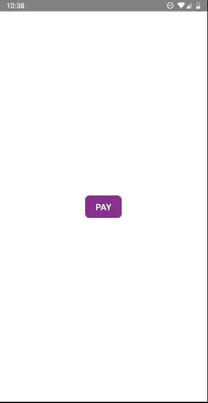

# rn-lunaone-sdk

Lunaone SDK for React Native Framework.


## Installation
### Install Dependencies
```bash
npm install react-native-svg
npx react-native link react-native-svg

npm install react-native-background-timer 
npx react-native link react-native-background-timer

npm install react-native-device-info
npx react-native link react-native-device-info

npm install react-native-qrcode-scanner react-native-camera
npx react-native link react-native-qrcode-scanner

npm install react-native-permissions
npx react-native link react-native-permissions
```

### Install Module
```bash
npm install github:uripsubekti13/rn-lunaone-sdk
```

## Examples

```javascript
import { LunaOneWrapper, LunaOne } from 'rn-lunaone-sdk'

onPay() {
  const amount = 10000;
  LunaOne.pay(amount) // LunaOne.pay(amount: number, transactionId?: string)
}

render() {
  return (
   <LunaOneWrapper
     apiKey={`YOUR API KEY HERE`}
     outletId={YOUR OUTLET ID HERE}
     onSuccess={(data) => console.log(data)} // on success callback, its optional
     dev={true} // if true the environment is `development` else if false it's `production`
     >
    .....
      <TouchableOpacity onPress={this.onPay} >
        <Text>Pay</Text>
      </TouchableOpacity>
   </LunaOneWrapper>
  );
};

```

## Screenshot

